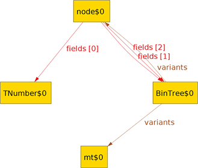

# Data Definition Comparison

## Motivation

There can be multiple ways to model a certain type of data. When students are
coming up with data definitions, they might create something equivalent to a
correct structure, but they might instead create something that does not contain
all the necessary data or contains possibly redundant information. We want to
model these data types as graphs and try to find isomorphisms between them. For
example, finding an injective but not isomorphic map between the nodes of a
student solution and the nodes of the correct solution might mean that the
student’s solution lacks the ability to express necessary data. On the other
hand, a surjective but not isomorphic map might indicate that the student’s
solution has multiple equivalent representations of the same information. In
discovering properties about correct and student graphs, we hope to establish
the foundation for a tool that will give students actionable feedback on their
data definitions.

We used Alloy\* to represent our data types and find mappings between them.

## Representation

In this project, we worked with algebraic data types: each type of data can be
represented as one or more variants, each of which is a collection of fields,
where a field is a name to type mapping. For example, here is a (Pyret) data
definition for a binary tree type:

```
data BinTree:
  | mt
  | node(val :: Number, left :: BinTree, right :: BinTree)
end
```

Here, the `BinTree` can be either the `mt` or `node` variant. The `mt` variant
has no fields, as empty trees contain no data, while the `node` variant has
three fields: `val`, the numerical data stored at the node, and `left` and
`right`, the children of this node. In general, our data types can be
self-referential or recursive.

Part of our project was an automated translation from these Pyret definitions
to our Alloy\* sigs. First, we have an abstract `Type` sig, which has a set
of `Variant`s. The `Variant` sig contains a sequence of `Type`s, which are the
fields of the variant (a sequence in Alloy is a functional `Int->Type` mapping).
We represented fields as sequences rather than sets because, as above in the
tree example, a variant might have multiple fields of the same type. Here is
an example of what the `BinTree` type graph would look like:



In order to compare a student's data definition to the "correct" instructor
definition, we had three abstract sigs extend `Type`: `StudentType`,
`InstructorType`, and `BuiltinType`. `StudentType`s and `InstructorType`s come
from data definitions written by students and instructors, respectively, while
`BuiltinType` are things like numbers and strings which neither students nor
instructors define, but both reference.

## Comparison

The purpose of our project is to perform a comparison between student-defined
and instructor-defined data types. To do so, we have Alloy\* attempt to find
a function from `StudentType` to `InstructorType`, or vice-versa.

In order to say that a student's representation is equivalent to the
instructor's, we constrain the function to be a bijection. A bijection itself
is not sufficient: if type A maps to type B, then the variants of type A must
be equivalent to those of type B. To define variant-equivalence, we again
construct a bijection, this time between the variants of type A and those of
type B. This bijection must have the property that if variant A maps to variant
B, they have the "same" fields, where two fields are the same if they are the
same `BuiltinType` or they are corresponding student and instructor types from
our initial bijection. The naming and ordering of fields does not matter for
this comparison.

If a student's definitions are not equivalent to the instructor's, it may be
that they are more or less expressive. The process for finding whether either of
these cases hold is very similar to the equivalence case. We looked at two ways
a type could be less expressive than another: it could be missing a variant or
a variant could be missing a field (there are other ways, but these were the two
we focused on). In the first case, we again found a bijection between types,
but then an injection between variants. Variants mapped to each other still had
to be equivalent. For the second case, we found an bijection between types and
between variants, but let the mapping between fields of a variant be injective.
Both of these comparisons can be done in the instructor to student or student
to instructor directions: instructor to student when the student was more
expressive, and student to instructor when the student was less expressive.

## Redundancy Analysis

Finally, we also attempted to do some analysis of variants within a type.
Consider the following definition:

```
data BinTree:
  | mt
  | one(val :: Number)
  | node(val :: Number, left :: BinTree, right :: BinTree)
end
```

The `one` variant is "redundant" in the sense that the same data could be
expressed as a `node` with `mt` `left` and `right` fields. We wanted to identify
when a type had a variant which could have all of its data represented through
the other variants of the type. While a programmer could intentionally use this
sort of redundancy to express some information beyond just the data contained in
the type, especially for a beginning programmer, this could be unintentional.

To perform this comparison, we see if there exists a variant such that there is
an injective mapping of fields of that variant (variant A) to another (variant
B). Variant A is "redundant" if the fields of variant B which are _not_ mapped
to could all contain no data: that is, the types of those fields have an empty
variant, one with no fields.

There are many more ways that this sort of redundancy could occur, but we felt
this was the most likely way a student could make this mistake.

## Conclusion

We believe that our project is a solid foundation for performing comparisons of
different data definitions. There are possible applications of this work for
introductory courses such as cs0111 and cs0190. Further extensions could include
adding more ways to compare student and instructor types, such as if one uses a
helper type that another does not, and making more robust the analysis of
possibly redundant types.
